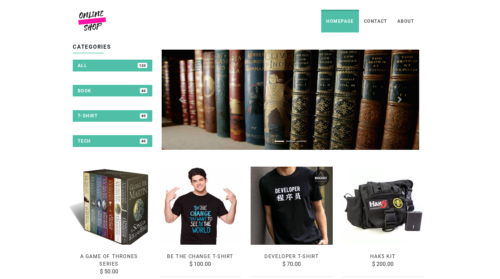
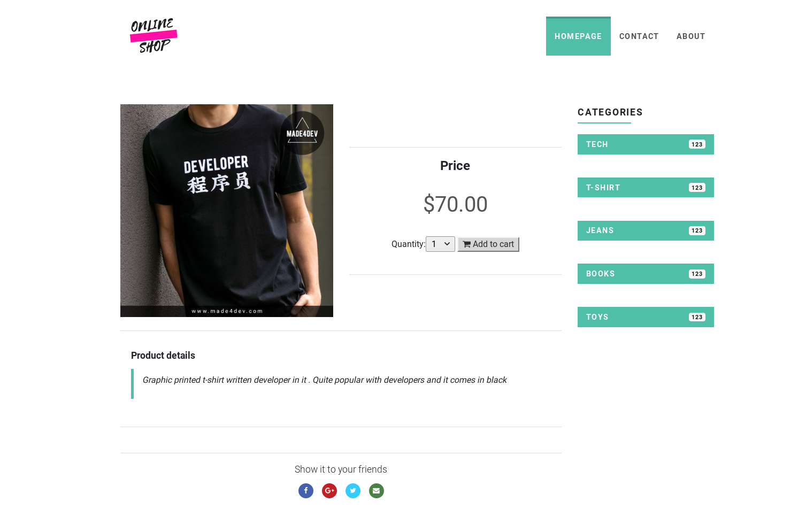

# Django Online Shop
> This is a e-commerce website built on django and besigned with Bootstrap.
### Installation:

**1.Setup Virtualenv**
```sh
virtualenv env
source env/bin/activate
```
**2.Clone Repo**
```sh
git clone https://github.com/shyam999/DjangoShop.git
```
**3.Install Requirements**
```sh
pip install -r requirements.txt
```
**4.Migrate Database**
```sh
python manage.py makemigrations
python manage.py migrate
```
**5.Create User**
```sh
python manage.py createsuperuser
```
**6.Run Server**
```sh
python manage.py runserver
```

# Screenshot:
### Homepage

### Product Details Page

### Cart Page

